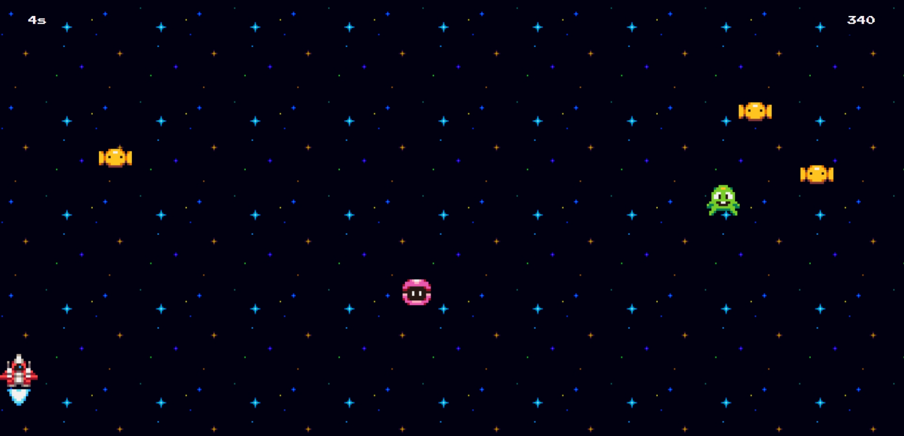

# Cosmic Invasion


## Sobre o Projeto
**Cosmic Invasion** é um jogo 2D de nave espacial onde o objetivo é derrotar os aliens antes que o tempo se esgote. O jogo oferece uma experiência integrada ao celular: ao ler um QR code na tela de início, o celular se torna o controlador (joystick).

## Tecnologias Utilizadas
- **Frontend:** JavaScript, HTML, CSS
- **Backend:** Node.js, Express, Socket.io
- **Outras:** qrcode

## Como Jogar
### Rodando Localmente
1. Clone o repositório:
   ```bash
   git clone https://github.com/
   cd cosmic-invasion
   ```

2. Instale as dependências:
   ```bash
   npm install
   ```

3. Inicie o servidor:
   ```bash
   npm start
   ```

4. Abra o navegador e acesse:
   ```
   http://localhost:3000
   ```

5. Na tela de "start", escaneie o QR code com o seu celular. O jogo começará e você poderá usar o celular como controlador.

### Testando Online
Você pode testar o projeto diretamente no seguinte link: [cosmicInvasion.vercel](https://cosmicInvasion.vercel)

## Contribuindo
Contribuições são sempre bem-vindas! Se você encontrar problemas, por favor, abra uma issue ou envie um pull request.

## Licença
Este projeto está sob a licença MIT. Veja o arquivo [LICENSE](./LICENSE) para mais detalhes.

---

Desenvolvido por [Carlos Eduardo](https://github.com/CarlosEduts).

Divirta-se jogando **Cosmic Invasion** e boa sorte derrotando os aliens!
